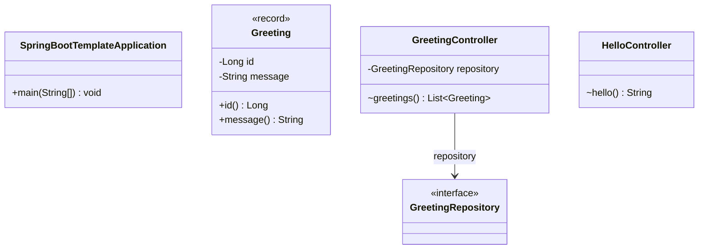

# クラス図

`./gradlew generateDocs` で生成する。手で編集しない。

```mermaid
classDiagram
  class SpringBootTemplateApplication {
    +main(String[]) void
  }
  class Greeting {
    <<record>>
    -Long id
    -String message
    +id() Long
    +message() String
  }
  class GreetingRepository {
    <<interface>>
  }
  class GreetingController {
    -GreetingRepository repository
    ~greetings() List~Greeting~
  }
  class HelloController {
    ~hello() String
  }
  GreetingController --> GreetingRepository : repository
```
